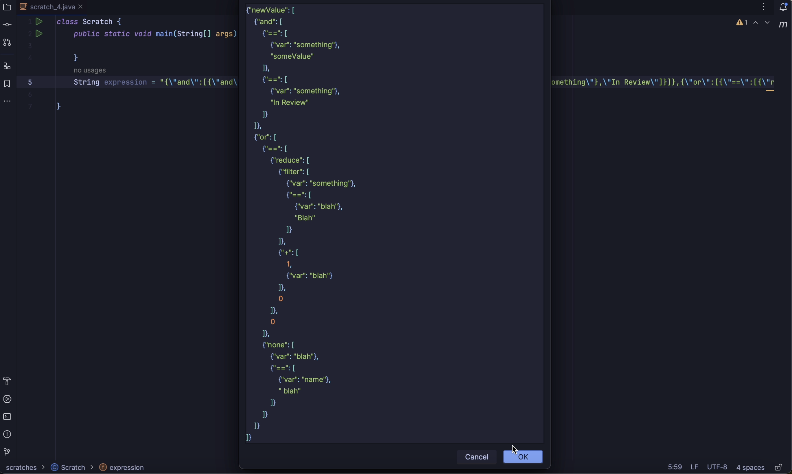

# JSON Viewer for Intellij

1. View JSON Strings in a prettified format.
2. Works only for properly formatted JSON Strings. The option to open the dialog in the prettified format won't work if the string isn't a valid json.

Working preview:
